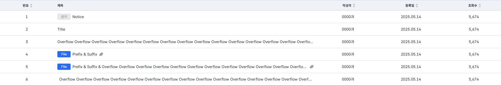

# Table 가이드

## Import

```ts
import { Badge, Icon, Table, TableRowWithIcon } from 'dak-design-system/components';
```

## 구조 및 프로퍼티

```tsx
<Table columns={columns} data={data} sorting={sort} setSorting={setSort} noData={'조회된 결과가 없습니다.'}/>
```

| Props      | Desc           | required | type                                         |
|------------|----------------|----------|----------------------------------------------|
| data       | Row 데이터        | required | `T`                                          |
| columns    | 컬럼             | required | `MRT_ColumnDef<T>`                           |
| sorting    | 정렬정보           | optional | `MRT_SortingState`                           |
| setSorting | 정렬정보 세팅        | optional | `Dispatch<SetStateAction<MRT_SortingState>>` |
| noData | 데이터 없을때 띄울 메세지 | optional | `string`                                       |

### data
테이블의 열 데이터 <br/>
열에 들어갈 값들을 개발자가 정의하여 사용한다.
```tsx
type Notice = {
    id: number;
    no: number;
    title: ReactNode;
    writer: string;
    createdAt: string;
    view: number | string;
};

const data: Notice[] = [
    {
        id: 0,
        no: 1,
        title: <TableRowWithIcon prefix={<Badge label={'공지'} />}>Notice</TableRowWithIcon>,
        writer: '0000과',
        createdAt: '2025.05.14',
        view: '5,674',
    },
    ...
]
```
### columns
테이블의 행 데이터 <br/>
MRT_ColumnDef의 제네릭에는 data 에서 정의한 타입을 넣어 사용한다.
```ts
const columns: MRT_ColumnDef<Notice>[] = [
    {
        accessorKey: 'no',
        header: '번호',
        enableSorting: true,
        size: 76,
        muiTableHeadCellProps: {
            align: 'left',
            sx: {
                //style
            }
        },
        muiTableBodyCellProps: {
            sx: {
                //style
            }
        }
    },
    ...
]
```
- 필수 입력 필드
  - accessorKey: 구분자. data 에서 정의한 타입의 키값을 넣는다. | string
  - header: 헤더의 라벨. | string
- 선택 입력 필드
  - enableSorting: 정렬 활성화 여부 | boolean
  - muiTableHeadCellProps: 커스텀 헤더 셀 스타일. 사용시 기존 스타일이 삭제될 수 있으니 주의
    - align: 텍스트 정렬. 기본적으로 center 값을 넣어줬다. | 'center' | 'left' | 'right' 
    - sx: 스타일 정의하는 부분. mui 처럼 inline style 형식으로 작성

### sorting, setSorting
정렬정보를 담는 상태값
```tsx
  const [sort, setSort] = useState<MRT_SortingState>([]);
  <Table columns={columns} data={data} sorting={sort} setSorting={setSort} />
```

데이터 형식
```json
[
  {
    "id": "accessorKey",
    "desc": boolean
  },
  {
    "id": "no",
    "desc": true
  },
  {
    "id": "writer",
    "desc": false
  },
  {
    "id": "createdAt",
    "desc": false
  }
]
```
### noData
데이터 없을때 띄울 메세지 <br/>
기본값: '조회된 결과가 없습니다.'

## 추가 컴포넌트

### TableRowWithIcon
셀에 텍스트뿐만 아니라 아이콘이 같이 들어갈 경우 data의 value로 넣어준다
```tsx
const data: Notice[] = [
  {
    id: 0,
    no: 1,
    title: (
      <TableRowWithIcon
        prefix={<Badge label={'File'} variant={'primary'} />}
        suffix={
          <Icon
            icon={'Attach'}
            size={20}
            style={{ display: 'flex', justifyContent: 'center', alignItems: 'center' }}
          />
        }>
        Prefix & Suffix
      </TableRowWithIcon>
    ),
    writer: '0000과',
    createdAt: '2025.05.14',
    view: '5,674',
  },
]
```
- prefix: 텍스트의 앞에 위치할 컴포넌트
- suffix: 텍스트의 뒤에 위치할 컴포너트
